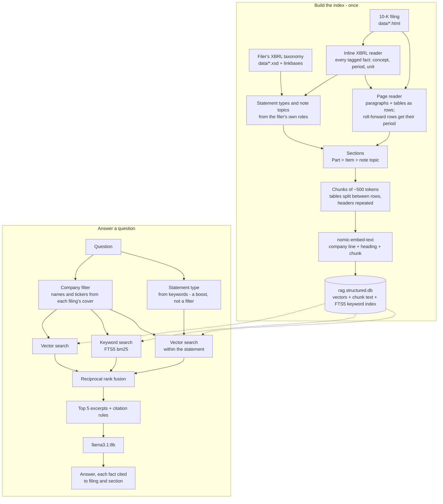

# RagFilingExplorer

A local, retrieval-augmented Q&A tool for SEC 10-K filings, built in C#/.NET.

**Zero cost, no API keys, no accounts.** Embedding, vector search, and answer generation all run
locally via [Ollama](https://ollama.com/) — nothing is sent to a hosted LLM API, and there's nothing
to sign up for.

Ask a natural-language question about one of the included filings and get an answer grounded in, and
cited to, the actual filing text — not the model's general knowledge.

```
> What were Microsoft's total assets?
(filtering to MSFT-10K-2026.html, boosting statement type: balance_sheet)

--- Answer ---
Microsoft's total assets were $758,376 million as of June 30, 2026 (Source: MSFT-10K-2026.html, PART II >
Item 8. Financial Statements and Supplementary Data).
```

**Why it's built this way** - why not answer from XBRL directly, PDF, `Microsoft.Extensions.DataIngestion`,
reranking, a calculator tool, or a bigger model - is answered briefly in [docs/Design-FAQ.md](docs/Design-FAQ.md).

## Three versions

- **v1** (tag `v1.0`) - `markitdown` converts each filing to text, which is split into sections and
  token-bounded chunks; a question's company and financial statement are hard filters on a vector search.
- **v2** (the current default) - the `Structured` strategy reads each filing's HTML and inline XBRL directly:
  tables stay whole blocks, every chunk knows its statement or note from the filer's own tags, roll-forward rows
  carry their period, and each chunk's embedding text opens with the company. Retrieval is hybrid - vector and
  SQLite FTS5 keyword search fused by reciprocal rank fusion, the statement a boost instead of a filter.
- **v3** (branch `v3`) - the app and its defaults unchanged; the evaluation moved from Python scripts into .NET with
  `Microsoft.Extensions.AI.Evaluation`: the strict grader and the retrieval rank as custom evaluators held exact to the
  Python originals, plus a new one that traces each figure in an answer to the excerpt and line it came from - every run
  stored, cached and reported ([Testing](#testing)).

v1's strategies still ship and are one setting away. Graded strictly (the expected figure, its unit and the exact
line), with `llama3.1:8b` at temperature 0:

| Question set | v1 | v2 |
|---|---|---|
| Main (Q1-Q24) | 22/24 | 22/24 |
| Targeted - mid-table rows, split tables, notes (T1-T10) | 4/10 | **7/10** |
| Variants of main questions - lookalike line, absent year, arithmetic (V1-V3) | 1/3 | 2/3 |
| Held-out, written before any v2 output (H1-H15) | 8/15 | **14/15** |
| Held-out, written mid-v2 and never tuned on (H16-H35) | - | 17/20 |
| Answer-side - lookalike lines, per-share, units, arithmetic (A1-A27) | - | 21/27 |

Routing tests (R1-R3), whose answer sits outside the statement a question's keywords point to: v1's hard filter
can only decline them (3/3 clean declines); v2 answers two and gets the third wrong. The runs are in `eval/`
(`baseline-v1/`, `structured-5a/`, `answer-side-norerank/`; the README there maps every folder), each measured
step in [docs/Decision-Log.md](docs/Decision-Log.md), "XBRL hybrid (v2)". v3's .NET evaluation re-ran all 102
questions on the v2 defaults and reproduced every grade but one (A16, where the model added an unrequested sum to the
same prompt - a change not explained; see [Repeatability](#the-evaluation)).

## How it works

Two flows: the index is built once (first run, or `--rebuild`), and then every question is answered from it.
This is the default (v2); v1's `markitdown` pipeline and `Vector` search are a setting away.



Everything runs locally: the embedding model and `llama3.1:8b` through Ollama, the index in one SQLite file.

## Stack

- **C# / .NET 10** — console app, top-level statements
- **Microsoft.Extensions.AI** + **Microsoft.Extensions.VectorData** — `IChatClient` /
  `IEmbeddingGenerator` / vector store abstractions
- **[OllamaSharp](https://github.com/awaescher/OllamaSharp)** — talks to a local Ollama instance;
  implements those abstractions directly, no custom wrapper
- **CommunityToolkit.VectorData.SqliteVec** — persistent, on-disk vector store (`rag.<strategy>.db`)
- **SQLite FTS5** via **Microsoft.Data.Sqlite** — the keyword half of hybrid search, `bm25()`-ranked, in the same file
- **AngleSharp** — parses each filing's HTML and inline XBRL (v2), and its tables (v1's `Linearized`)
- **Microsoft.ML.Tokenizers** (offline Tiktoken, `cl100k_base`) — token-bounded chunking
- **Microsoft.ML.OnnxRuntime** — an optional local cross-encoder reranker, off by default
- **Microsoft.Extensions.AI.Evaluation** (+ `.Reporting`, `.Quality`) — the evaluation (v3): custom evaluators, stored
  results, response caching and the HTML report; `.Quality`'s Equivalence as a local judge, run alongside the strict grade when asked for (`Graders`)
- **Local models**: `nomic-embed-text` (274MB, embeddings) and `llama3.1:8b` (4.9GB, answer generation)
- **Source data**: public [SEC EDGAR](https://www.sec.gov/edgar) 10-K filings (raw HTML)

## Prerequisites — zero *cost*, not zero *setup*

- .NET SDK `10.0.400` (pinned via `global.json`)
- [Ollama](https://ollama.com/) installed and running, with both models pulled:
  ```
  ollama pull nomic-embed-text
  ollama pull llama3.1:8b
  ```
- **Only for v1's strategies** (`Markdown`, `Linearized`): Python 3.12 + `pip install markitdown` - they shell
  out to the `markitdown` CLI to convert filing HTML to text ([docs/Decision-Log.md](docs/Decision-Log.md),
  Step 3, for why). The default `Structured` strategy reads the HTML itself and needs no Python.
- **Optional:** the reranker's model (`Retrieval:Rerank`, off by default), fetched separately - see
  `appsettings.json` and Decision-Log.md, "Step 2b resumed".
- The evaluation runs in .NET (v3) and needs nothing more. The Python scripts in `tools/` are the grader and
  retrieval replay it was ported from (standard library only), kept as the reference the parity tests were
  measured against, and v2's reranker spikes (also `numpy`, `onnxruntime`, `tokenizers`).

No API keys, no `dotnet user-secrets`, no cloud account of any kind.

## Hardware expectations

Developed and tested on a 12th Gen Intel i7-12800H, 32GB RAM, **CPU-only inference** (no GPU) — both
models were chosen specifically because they run acceptably on CPU alone.

- **First run** reads, chunks, and embeds every filing in `data/` and builds the index
  (`rag.structured.db` for the default chunking strategy) from scratch: 975 chunks across the 4 included
  filings. On the hardware above, embedding is the slow part - about **6 minutes** (`Linearized`'s 999 chunks
  took 377 s; v1's `Markdown`, 1,444 chunks, about 10 minutes).
- **Every run after that** finds the existing index and skips straight to the interactive loop —
  well under a minute to start.
- Each answer involves one local `llama3.1:8b` generation call, CPU-only. A question whose excerpts the model
  hasn't read before takes **about a minute or more**: on the hardware above, ~50 s to read a ~2,400-token prompt
  (~45 tokens/s) and ~20 s to write the answer (~6 tokens/s). Repeated or overlapping questions are much faster,
  because Ollama keeps already-read prompts in a RAM cache and skips re-reading a shared beginning.

## Running it

```
dotnet run --project RagFilingExplorer.Local
```

Works from any directory - `data/`, `chunk-review/` and the index are located relative to the repo
root, not the directory you launch from. The first line of output names the chunking strategy and
index in use.

- `--rebuild` — deletes the current strategy's index and rebuilds from scratch. Needed after changing chunking/embedding
  *code*; changes to settings or filings are detected automatically (see below).
- `--verbose` — also prints the full ranked candidate list for each question (score, filing, statement
  type, heading, snippet). Useful when diagnosing a bad retrieval; not needed for normal use.
- `--chunks-only` — chunks every filing and writes `chunk-review/<strategy>/`, then exits: no Ollama, no
  index. The fast way to read real chunk output after a chunking change.

Type a question at the `>` prompt; a blank line or `exit` quits.

### Startup checks

Before doing any work, the app checks for the problems most likely to trip up a fresh clone, and
exits with a one-line fix instead of a stack trace:

- Ollama isn't reachable at the configured URL, or either configured model isn't pulled (the error
  prints the exact `ollama pull` command).
- The `markitdown` CLI isn't on `PATH` (v1's strategies only, and only when an index build is actually needed).
- A filing's XBRL taxonomy (`.xsd`, plus its linkbases when they're separate files) isn't in `data/` next to it
  (`Structured`), or one of its Statement roles can't be mapped to a statement type - both stop the build with
  the reason, rather than mislabel chunks.
- The reranker is on but its model is missing or fails its SHA-256 check, or `Retrieval:Search` isn't `Hybrid`.
- **The index can't be trusted.** A build writes `rag.<strategy>.db.manifest.json` only after every
  chunk has been embedded. It records the embedding model, the chunking strategy and settings, and a
  SHA-256 hash of every filing. If the index has no manifest, the last build was interrupted or failed. If the manifest doesn't match
  the current `appsettings.json` and `data/`, the index is stale. Either way the app says exactly what's
  wrong and asks for `--rebuild` rather than silently answering from a partial or mismatched index.
  (A changed embedding model is the worst case: query vectors from the new model compared against
  stored vectors from the old one retrieve noise with no error at all.)
- Each filing registers its company for the company filter from its own tagged cover facts (name and
  ticker); a filing that tags no registrant name stops startup with a message saying so.

## Configuration (`appsettings.json`)

The tunable knobs — model names, Ollama's base URL/timeout, chunking strategy and chunk size/overlap,
tokenizer model, vector-store upsert batch size, search mode, reranking, and retrieval top-K/temperature — live in
[`RagFilingExplorer.Local/appsettings.json`](RagFilingExplorer.Local/appsettings.json), not hardcoded
in `Program.cs`. Every key is required: the app validates on startup that each one is actually present
and fails with a clear error naming the missing key, rather than silently falling back to some other
default hiding in code.

**Do not change `VectorStore.UpsertBatchSize` above `1`** as long as this project is pinned to
`CommunityToolkit.VectorData.SqliteVec` `1.0.1-preview` (see the `.csproj`). That version's `vec0`
upsert workaround throws `SQLite Error 1: 'UNIQUE constraint failed on vec_chunks primary key'` on any
multi-record batch — reproducible on the very first batch against an empty table, so it isn't a real
duplicate-key issue in the data. It's a known, already-fixed upstream `sqlite-vec` bug that the NuGet
package just hasn't picked up yet. Full details, including why manually swapping in the newer native
`vec0.dll` was considered and rejected, are in
[docs/Decision-Log.md](docs/Decision-Log.md) ("Follow-up: persisted vector store"). If
this project ever upgrades past that SqliteVec version, re-check whether the fix landed before raising
this value — batching does meaningfully reduce embedding calls otherwise.

### Chunking strategies

`Chunking.Strategy` selects how filings are turned into chunks. Each strategy builds its own index
(`rag.<strategy>.db`) and chunk dumps (`chunk-review/<strategy>/`), so once each is built, switching is
a one-line settings change with no re-embedding - which is what makes side-by-side comparison practical.

- **`Structured`** (default, v2) - the filing's HTML is parsed once as a DOM (AngleSharp; no `markitdown`) and
  its inline XBRL read first. The page becomes typed blocks - paragraphs, and each top-level table linearized
  into self-contained rows - grouped into sections by v1's heading rules and packed by v1's chunker, so every
  chunk knows which blocks, tables and facts it holds. From the filing's own tags: a "Cover Page" profile chunk
  (address, auditor, fiscal year, ticker); each primary statement's type from the filer's Statement roles, not its
  title; each note as a section headed by its topic; a roll-forward row's period ("(fiscal 2025, year ended May
  31, 2025)"); and the company line ("Oracle Corporation (ORCL), Form 10-K for fiscal year 2026.") opening every
  chunk's embedding text. Built in measured steps - [docs/Decision-Log.md](docs/Decision-Log.md), "XBRL hybrid
  (v2)".
- **`Markdown`** (v1's default) - `markitdown` converts the whole filing to Markdown, sections are found from
  the plain-text Item headings, and oversized Markdown tables are split with their header, fiscal-period
  row and row-group labels repeated on every piece.
- **`Linearized`** - each HTML table is first turned into self-contained lines ("Comprehensive income —
  2026: $133,812 | 2025: $104,075") by `HtmlTableLinearizer`, working from the HTML because `markitdown`
  discards `colspan`. A split table repeats its statement title, units and period caption on every piece.
  A table it can't linearize unambiguously - or would lose any cell text from - falls back to the
  Markdown handling. 999 chunks vs 1,444. Ties `Markdown` on the original 24 questions; on 10 targeted
  questions (mid-table rows, split layouts, MD&A/notes tables) it gets the answer into the model's
  context for 7 vs 4 and answers 5 vs 4 correctly, with named trade-offs - see
  [docs/Decision-Log.md](docs/Decision-Log.md), "targeted questions and a rank metric". The final manual
  pass confirmed it (22/24 reliable on both, 5 vs 4 targeted) but Linearized missed two questions `Markdown`
  answers, so `Markdown` stayed v1's default ("manual pass (v1)").

Everything after chunking (embedding, retrieval, generation) is shared, so a strategy only has to implement
`IChunkingStrategy`. v1's strategies leave the statement type to title detection afterwards; `Structured` sets it.

### Search

`Retrieval.Search` selects how a question's candidates are found; the company filter is hard in both.

- **`Hybrid`** (default, v2) - three ranked lists, fused by reciprocal rank fusion (k = 60): a vector search, an
  FTS5 keyword search (`bm25()`, over the question's content words), and - when the question names a financial
  statement - a vector search within that statement, which boosts its chunks without excluding any others. Chosen
  by a replay of six variants before it was built; it reaches the routing questions a hard filter can't.
- **`Vector`** (v1) - one vector search, with the question's statement type as a hard filter.

`Retrieval.Rerank` adds a local cross-encoder (`ms-marco-MiniLM-L6-v2`, ONNX) that reorders each company's top 25
hybrid candidates. It's built, tested and measured, and off by default: it prefers prose to statement rows, and
across every question set hybrid search alone puts as many answers in the model's context
([docs/Design-FAQ.md](docs/Design-FAQ.md)).

### Reasoning-model support

Models like `deepseek-r1`, `phi4-reasoning`, or `qwen3.5` emit an internal chain-of-thought ("thinking")
separately from their final answer. This app supports that deliberately, not just tolerates it, after
`qwen3.5:2b` (tested as a reference model, not the shipped default) exposed two real bugs:

1. Given this app's longer retrieved-context prompts, the model burned its entire generation budget on
   chain-of-thought and produced **no answer at all** — Ollama's own streaming response keeps `thinking`
   and `content` in genuinely separate fields, and OllamaSharp maps `thinking` into a distinct
   `TextReasoningContent` item that `ChatResponseUpdate.Text` doesn't include, so nothing upstream even
   noticed.
2. Naively sending a "think" request to a model that doesn't support reasoning at all doesn't get
   ignored — Ollama rejects it outright with a hard error (`"<model>" does not support thinking`), which
   took down the entire interactive session the first time it happened.

What ships now, in `RagAnswerService`, `OllamaSetup` and `InteractiveSession`:

- **`Retrieval.ReasoningEffort`** (one of `None`/`Low`/`Medium`/`High`/`ExtraHigh`) is only applied to
  questions `QueryIntentResolver.RequiresSynthesis` flags as needing genuine multi-step reasoning
  (comparisons, ratios, trends) — a plain single-fact lookup always uses `Effort.None`, so reasoning is
  never wasted on a task that doesn't need it.
- **Capability check at startup**: `OllamaSetup` calls Ollama's own `/api/show` for the configured
  `ChatModel` and only ever routes a question to reasoning if `"thinking"` is actually in that model's
  capability list — never assumed from the model name.
- **`Retrieval.MaxOutputTokens`** sets an explicit output ceiling for every chat model (thinking plus
  answer, for a reasoning model), instead of relying on Ollama's own default, which is exactly what let
  the budget-exhaustion bug happen silently. It shares Ollama's context window (`num_ctx`, 4096 by
  default) with the prompt, so it's sized at 768: a reasoning model gets little room to think unless
  `num_ctx` is raised too.
- **A starved-response guard**: if a model still hits that ceiling without ever producing real answer
  text, the app fails with a clear, specific error instead of showing an empty answer.
- **The interactive loop no longer dies on one bad turn**: any failure during a single question's
  generation (a starved response, an unsupported request, a dropped connection) is caught, reported, and
  the session continues to the next question.

Apart from the output ceiling, all of this is a no-op for a non-reasoning model like `llama3.1:8b` — it
reports no `"thinking"` capability, so `ReasoningEffort` never applies to it regardless of question or
configuration.

### Adding a new filing

Dropping a new `.html` file into `data/` (the app will then ask for `--rebuild`) is necessary but **not sufficient** -
onboarding Netflix (`NFLX-10K-2025.html`) surfaced three real bugs (and a later review found a fourth, in Nasdaq's filing), all fixed generically rather than
with filer-specific code, but worth checking for explicitly with any new filing. The
`filer-onboarding-checker` subagent in `.claude/agents/` runs these checks and reports with evidence.

1. **Add its XBRL taxonomy too** (`Structured`). From the filing's EDGAR folder, next to the `.html`: the
   `.xsd`, plus the `_pre`/`_lab`/`_cal`/`_def.xml` linkbases when the filer ships them as separate files (NDAQ
   and NFLX do). Statement types and note topics are read from it; without it the build stops and says so.

2. **Check the company registered.** An unregistered company runs every question naming it **unfiltered
   across every filing** (the exact cross-company contamination metadata filtering exists to prevent) -
   the most consequential of the NFLX bugs: it caused a hallucinated figure, not just a missed answer.
   v1 kept a hand-written name/ticker table (`QueryIntentResolver.CompanyToFiling`); since v2 each filing
   registers itself from its tagged cover facts (`CompanyRegistry`: registrant name without its legal form,
   plus the common stock's ticker). Startup prints each registration ("Company filter: Netflix / NFLX ->
   NFLX-10K-2025.html") - check the new one reads as questions will name the company.
3. **Don't assume the source is UTF-8.** A raw EDGAR download usually is, but a browser-saved copy can
   declare (and genuinely be encoded as) something else entirely - Netflix's was `windows-1252`.
   `MarkItDownConverter.DetectEncoding` handles this automatically now (BOM, then the file's own
   `<meta charset>`, then a UTF-8 fallback), but it's worth spot-checking `chunk-review/<strategy>/*.chunks.txt`
   for stray `�` characters after a first run regardless.
4. **Item-heading punctuation varies by filer.** Netflix's converted output has no space after the
   period in most Item headings (`"Item 1.Business"` vs. the usual `"Item 1. Business"`) -
   `SectionSplitter.TitledItemHeaderRegex` now tolerates both, but a filer with a still-different
   convention could reintroduce this class of bug. Check `chunk-review/<strategy>/<new-filing>.chunks.txt` for a
   complete, correctly-nested Item outline before trusting the citations it produces.
5. **Statement titles vary too** (v1's strategies). Statement-type filtering only works if each financial
   statement's title line is recognized - Nasdaq's "Consolidated Statements of *Changes in* Stockholders' Equity"
   wasn't at first, so every Nasdaq equity question found nothing. After a first run, check that the index
   tags each of the new filing's statements (see `docs/Implementation_Plan.md`, "Live constraints").
   `Structured` reads the types from the filer's Statement roles instead, and stops the build on one it can't map.

`dotnet test` then checks the new filing's registration too: its name, ticker and company line, and that no
name would route a question to two filings.

Full diagnostic detail, including how each bug was actually found, is in
[docs/Decision-Log.md](docs/Decision-Log.md) ("Follow-up: onboarding a new filer (NFLX)").

## Known limitations

- **Derived figures aren't reliable.** Sums, differences and ratios are computed by the model, which predicts
  digits rather than calculating: asked to add three 8-digit figures, it gave a slightly wrong total every time,
  across four phrasings. A calculator tool was screened in v2: `llama3.1:8b` called it every time, fixed the ratio
  it had divided wrongly, and lost two answers it had right - it copied figures into the call wrongly. Check any
  figure the filing doesn't state directly.

- **The model can pick a plausible neighbour of the right figure.** The answer is in its context, next to a
  lookalike: Nasdaq's "Comprehensive income" and "Comprehensive income attributable to Nasdaq"; dividends
  *declared* in the equity statement where the question asks what was *paid* (the cash flow statement); MD&A's
  rounded "$55.7 billion" over the table's $55,663 million. Prompt rules didn't fix these - v1 tried three
  wordings, v2 screened one more - so check the cited line.

- **Statement routing is keyword matching.** A question's statement is found by substrings - "deferred revenues"
  points to the income statement, though the figure is on the balance sheet. Under the default hybrid search
  that's only a boost, and such questions can be answered; under `Vector` search (v1) it's a hard filter, and
  answers elsewhere in the filing - segment breakdowns, MD&A, accounting policies, another statement - can't be
  retrieved. See [docs/Design-FAQ.md](docs/Design-FAQ.md).

## What I'd do differently

- **Start from the data, not the tool.** The pipeline was chosen before the filings were studied: a document
  library first, and when that failed, its Markdown converter. An hour with the source would have shown that
  every 10-K follows a structure fixed by regulation (Parts and Items) and tags every financial figure in inline
  XBRL with its concept, period, unit and scale. Much of the later work - recovering table structure, carrying
  units onto split tables, detecting statements from their titles - rebuilds information the filings already
  state. v2 starts there ([Decision-Log.md](docs/Decision-Log.md), "XBRL hybrid (v2)").
- **Pick the stack from strengths, the pipeline from the data.** .NET was the right choice and covers every part
  of that design. The assumption was the conversion step - which is also what brought in Python. v2 reads the
  HTML in .NET, and its default needs no Python at all.
- **Keep what's searched separate from what the model reads.** Tables were embedded and shown in the same
  Markdown form; roughly half of a financial statement's tokens turned out to be empty cells, slowing every answer
  and giving the model noise to count through.
- **Build the evaluation early, and grade strictly from the start.** The question set and the retrieval replay
  are what made every decision here measurable. But an earlier, looser grading scored the main questions 24/24;
  requiring the unit and the exact line exposed eight problems. And no question touched Microsoft's cover page,
  so a bug that silently dropped it survived every test.
- **Keep arithmetic out of the model - all of it, operands included.** It predicts digits rather than
  calculating, so sums and ratios belong in code. But a calculator the model calls only moves the error: at 8B,
  two of its eight calls carried a figure copied wrongly (5,407,990 became 100407990). Code has to choose the
  operands too - from the tagged facts, not from the model's reading.
- **Screen before a full run, and keep writing fresh questions.** A larger reranker, a prompt rule and the
  calculator were each dropped after minutes of targeted calls, not a two-hour run. Reranking itself was built,
  measured and kept on the question sets it was chosen with; a set written afterwards showed what it cost.

## Testing

```
dotnet test
```

Runs both test projects, fully offline - no live Ollama instance or populated vector store required.
`RagFilingExplorer.Local.Tests` (NUnit + Moq, 373 tests) covers chunking, section splitting, statement-type detection,
query-intent resolution, company registration, settings loading/validation, index-manifest staleness detection,
the retrieve+generate orchestration (mocked; hybrid search against a real FTS5 file, reranking with a fake
scorer), the reranker's tokenization, and v2's page reader, structure labels and inline XBRL reader - checked
against the filings in `data/`, read-only, including fact for fact against EDGAR's own extraction.
`RagFilingExplorer.Local.Evaluation` (156 offline tests) checks the evaluators themselves.

### The evaluation

The unit tests don't judge answers. That's the evaluation, run on the real app with the real model:
[docs/Manual-Test-Questions.md](docs/Manual-Test-Questions.md) holds every question with its expected answer,
sourced from the filings - the main set, targeted and routing questions, two held-out sets and the answer-side set -
and `tools/expected-answers.json` what grading checks. Since v3 it runs in .NET, in
`RagFilingExplorer.Local.Evaluation`, with `Microsoft.Extensions.AI.Evaluation`: every question asked in-process
through the app's own composition, each a stored scenario, the model's responses cached, an HTML report at the end.
Three deterministic evaluators - no model judges an answer:

- **Strict grade** - the expected figure, its unit and the exact line; a clean decline where the filing doesn't say.
  A port of `tools/grade_answers.py`, held to it on all 1,029 answers graded in v1 and v2 (`GraderParityTests`).
- **Answer rank** - where the expected figure ranks among the retrieved chunks, so "retrieval missed it" is told
  apart from "the model misread it". A port of `tools/replay_recall.py`, matching it on all 102 questions.
- **Figure source** - each figure the answer states, traced to the excerpts the model was given: which ones hold it,
  their statement type and section, and the line. A figure in none is flagged, unless the question asked for a
  calculation. On v2's defaults it flags nothing: every wrong answer is a misreading of a figure in its context.

For an answer that doesn't pass, the report says what went wrong in words - "States 27,034 (dividends declared (equity
statement), not paid (cash flow statement)) instead of the expected 26,445 million." - and where the expected figure was:
on a line in one of the excerpts (a misreading), derived from figures the model had (a calculation), or in none of them
(a retrieval miss). What each trap is comes from `trap_why` in `tools/expected-answers.json`.

Each case's conversation shows what the model was given: the app's system prompt as sent, the five excerpts with their
headers - the filing's name links to the filing in `data/` (with "Render markdown" on) - and the question.

Each case is tagged, so the report filters by tag: its kind (`figure`, `fact`, `negative`, `routing`), `calculation`,
`has traps`, the company and statement the app routed it to - where the app sent it, not where the answer is - and the
Ollama build that served the run (`ollama:0.35.1`), since an Ollama update can change answers.

**Adding a question:** its text goes in its set's file in `tools/` (`manual-questions.txt`, `heldout-questions.txt`,
`answer-questions.txt`), its source in `docs/Manual-Test-Questions.md`, and its entry - matched by the exact text - in
`tools/expected-answers.json`: `kind`, `expect` and `unit` (what's graded); `chunk_expect`, the answer as the chunk prints
it ("(26,445)"), or every input of an asked-for calculation and not its result; `traps`, each with its `trap_why`; and
`conflicts`/`accept` for a lookalike line. `dotnet test` checks the entry is complete (`ExpectedAnswersTests`). Only the new
question is asked afresh - the others come from the cache.

```
dotnet test RagFilingExplorer.Local.Evaluation --filter "FullyQualifiedName~EvaluationRunTests"
```

asks all 102 questions (about two hours on the hardware above; minutes from the cache) and writes
`eval/v3-runs/report-<execution>.html` and a summary; `eval/v3-runs/report.html` holds every run, v1's included,
newest first.

A run is set up in
[`RagFilingExplorer.Local.Evaluation/evalsettings.json`](RagFilingExplorer.Local.Evaluation/evalsettings.json), the
evaluation's counterpart of the app's `appsettings.json` - every key required and checked when a run starts:

- `Graders` - `strict` (the strict grade, the default), `judge` (the model judges in `Judges`, e.g. `equivalence`), or
  `both`, side by side. Answer rank and figure source always run; they need no model.
- `Execution` (the run's name; empty: `structured-hybrid-<date>`), `Sets` and `Only` (which questions, comma-separated),
  `NoCache` (ask the model afresh instead of replaying the cache), and the rest, described in `EvaluationSettings`.

An environment variable overrides one key for one run, with the same name - `Evaluation__Graders=both`,
`Evaluation__Only=Q1,A16` - which is how the run scripts set a pass. Two measurements build on it:

- **Repeatability** (`tools/run-variance.ps1`): all 102 questions asked afresh twice came back word for word identical -
  at temperature 0 the model repeats exactly on the same setup. Against answers from three days earlier, 100/102 grades
  matched and one question changed score; Ollama had updated itself in between (0.35.0 -> 0.35.1, a newer llama.cpp), so
  runs are compared only on the same Ollama build.
- **A local judge** (`tools/run-judge.ps1`): Microsoft's Equivalence evaluator, scored by `llama3.1:8b`, agreed with the
  strict grade on 87 of 101 answers - but passed 14 of the 18 wrong ones, rating $27,034 million against $26,445 million
  "a slight difference". It rates similarity, not the exact figure, so the strict grade stays the grade and the judge
  runs alongside it when asked for (`Graders: both`).

Every measured run, v1's on, is kept in `eval/`.

## Why MarkItDown, not Microsoft.Extensions.DataIngestion

`Microsoft.Extensions.DataIngestion` (MEDI) was the original plan for document reading and chunking,
and was deliberately tried before being abandoned — not skipped. In short: MEDI's document readers
don't handle raw HTML directly, its heading-based chunkers have nothing to key off because SEC EDGAR
HTML has zero real `<h1>`–`<h6>` heading tags, and its hardcoded Markdig math extension crashes on
dollar-figures in financial tables. The full diagnostic path is in
[docs/Decision-Log.md](docs/Decision-Log.md) (Step 3).

What v1 shipped instead is a small hand-written pipeline: `markitdown` (the CLI) for HTML→text conversion,
then pattern-matching over the converted text for section boundaries and table-aware token chunking. v2's
`Structured` strategy drops the conversion step: it reads the HTML as a DOM with AngleSharp - which Microsoft's
own ASP.NET Core test docs use; .NET has no built-in HTML parser - and keeps v1's heading and packing rules.

## Project structure

```
RagFilingExplorer.Local/                the app - chunking, retrieval, vector store, interactive loop
RagFilingExplorer.Local.Tests/          NUnit + Moq test suite
RagFilingExplorer.Local.Evaluation/     the evaluation (v3): evaluators, runner, report, variance and judge measurements
data/                                   source 10-K filings (HTML, from sec.gov/edgar), plus each filing's XBRL
                                        taxonomy (.xsd, and _pre/_lab/_cal/_def.xml where not embedded); EDGAR's
                                        extracted facts (_htm.xml) are gitignored - download them to run the XBRL
                                        reader's EDGAR comparison test, which skips without them
chunk-review/<strategy>/                full per-chunk text dumps, one file per filing, for manual review
tools/                                  the question files and expected-answers.json; run-variance.ps1 and
                                        run-judge.ps1 (v3's overnight measurements); grade_answers.py and
                                        replay_recall.py (the Python originals of the strict grade and the rank);
                                        rerank_spike.py; LinearizeSpike + xbrl_column_check.py
eval/                                   every measured run: logs, grades, replays, screens - mapped in its README;
                                        v3-runs/ holds the .NET evaluation's stored runs and reports
.claude/                                Claude Code config: filer-onboarding-checker subagent, test-convention rule
docs/Implementation_Plan.md             current-state reference: ground rules, pipeline, live constraints
docs/Decision-Log.md                    the full build history: every step, decision point, and debugging path
docs/Manual-Test-Questions.md           a broader question set for manual retrieval-quality testing
docs/Design-FAQ.md                      short answers to "why not X?" design questions, linked to the log
```

## Further reading

[docs/Implementation_Plan.md](docs/Implementation_Plan.md) is the short current-state reference;
[docs/Decision-Log.md](docs/Decision-Log.md) has the complete build history and decision log — every dead end and bug found along the way (MEDI's abandonment, a SqliteVec upsert bug, the
statement-type detector false positives that silently mistagged 96 chunks, three real bugs found
onboarding a fourth filing, and more). This README is deliberately the short version.
