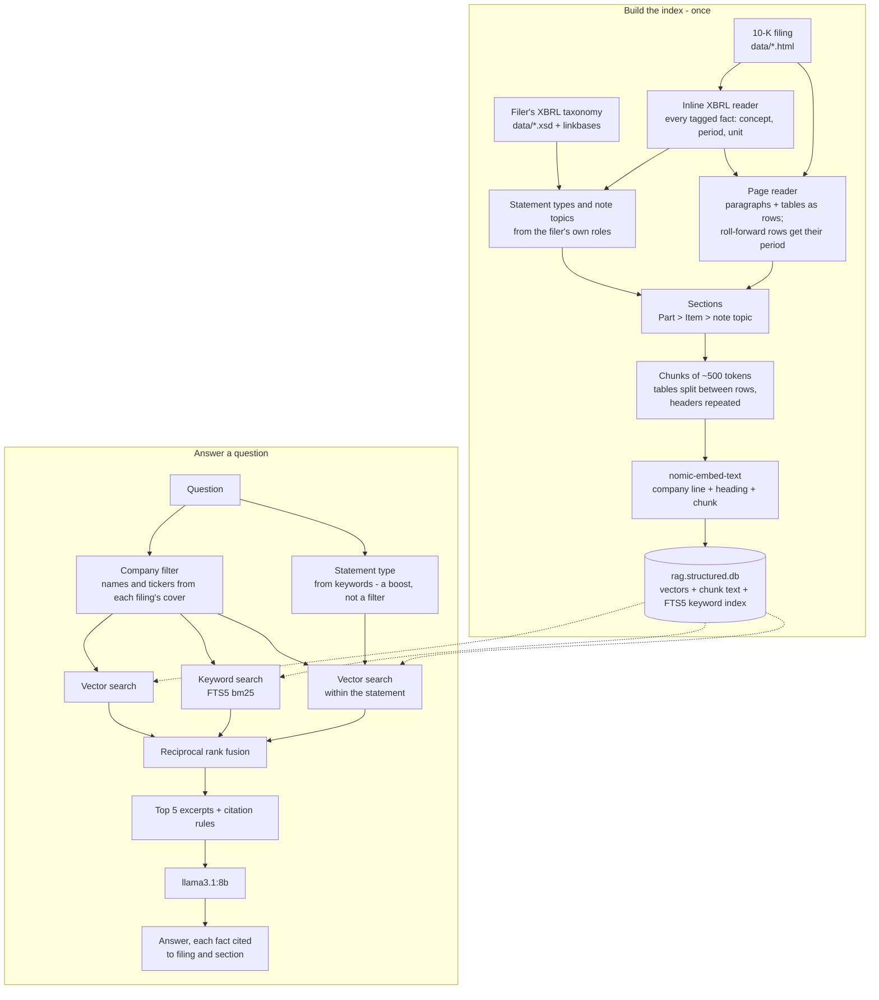

# RagFilingExplorer

A local, retrieval-augmented Q&A tool for SEC 10-K filings, built in C#/.NET.

**Zero cost, no API keys, no accounts.** Embedding, vector search, and answer generation all run
locally via [Ollama](https://ollama.com/) — nothing is sent to a hosted LLM API, and there's nothing
to sign up for.

Ask a natural-language question about one of the included filings and get an answer grounded in, and
cited to, the actual filing text — not the model's general knowledge.

```
> What were Microsoft's total assets?
(filtering to MSFT-10K-2026.html, boosting statement type: balance_sheet)

--- Answer ---
Microsoft's total assets were $758,376 million as of June 30, 2026 (Source: MSFT-10K-2026.html, PART II >
Item 8. Financial Statements and Supplementary Data).
```

**Why it's built this way** - why not answer from XBRL directly, PDF, `Microsoft.Extensions.DataIngestion`,
reranking, a calculator tool, or a bigger model - is answered briefly in [docs/Design-FAQ.md](docs/Design-FAQ.md).

## Three versions

- **v1** (tag `v1.0`) - `markitdown` converts each filing to text, which is split into sections and
  token-bounded chunks; a question's company and financial statement are hard filters on a vector search.
- **v2** (tag `v2.0`, the current default) - the `Structured` strategy reads each filing's HTML and inline XBRL directly:
  tables stay whole blocks, every chunk knows its statement or note from the filer's own tags, roll-forward rows
  carry their period, and each chunk's embedding text opens with the company. Retrieval is hybrid - vector and
  SQLite FTS5 keyword search fused by reciprocal rank fusion, the statement a boost instead of a filter.
- **v3** (tag `v3.0`) - the app and its defaults unchanged; the evaluation moved from Python scripts into .NET with
  `Microsoft.Extensions.AI.Evaluation`: the strict grader and the retrieval rank as custom evaluators held exact to the
  Python originals, plus a new one that traces each figure in an answer to the excerpt and line it came from - every run
  stored, cached and reported ([The evaluation](#the-evaluation)).

v1's strategies still ship and are one setting away. Graded strictly (the expected figure, its unit and the exact
line), with `llama3.1:8b` at temperature 0:

| Question set | v1 | v2 |
|---|---|---|
| Main (Q1-Q24) | 22/24 | 22/24 |
| Targeted - mid-table rows, split tables, notes (T1-T10) | 4/10 | **7/10** |
| Variants of main questions - lookalike line, absent year, arithmetic (V1-V3) | 1/3 | 2/3 |
| Held-out, written before any v2 output (H1-H15) | 8/15 | **14/15** |
| Held-out, written mid-v2 and never tuned on (H16-H35) | - | 17/20 |
| Answer-side - lookalike lines, per-share, units, arithmetic (A1-A27) | - | 21/27 |

Routing tests (R1-R3), whose answer sits outside the statement a question's keywords point to: v1's hard filter
can only decline them (3/3 clean declines); v2 answers two and gets the third wrong. The runs are in `eval/`
(`baseline-v1/`, `structured-5a/`, `answer-side-norerank/`; the README there maps every folder), each measured
step in [docs/Decision-Log.md](docs/Decision-Log.md), "XBRL hybrid (v2)". v3's .NET evaluation re-ran all 102
questions on the v2 defaults and reproduced every grade but one (A16, where the model added an unrequested sum to the
same prompt - a change not explained; see [The evaluation](#the-evaluation)).

## How it works

Two flows: the index is built once (first run, or `--rebuild`), and then every question is answered from it.
This is the default (v2); v1's `markitdown` pipeline and `Vector` search are a setting away.



## Stack

- **C# / .NET 10** — console app, top-level statements
- **Microsoft.Extensions.AI** + **Microsoft.Extensions.VectorData** — `IChatClient` /
  `IEmbeddingGenerator` / vector store abstractions
- **[OllamaSharp](https://github.com/awaescher/OllamaSharp)** — talks to a local Ollama instance;
  implements those abstractions directly, no custom wrapper
- **CommunityToolkit.VectorData.SqliteVec** — persistent, on-disk vector store (`rag.<strategy>.db`)
- **SQLite FTS5** via **Microsoft.Data.Sqlite** — the keyword half of hybrid search, `bm25()`-ranked, in the same file
- **AngleSharp** — parses each filing's HTML and inline XBRL (v2), and its tables (v1's `Linearized`)
- **Microsoft.ML.Tokenizers** (offline Tiktoken, `cl100k_base`) — token-bounded chunking
- **Microsoft.ML.OnnxRuntime** — an optional local cross-encoder reranker, off by default
- **Microsoft.Extensions.AI.Evaluation** (+ `.Reporting`, `.Quality`) — the evaluation (v3): custom evaluators, stored
  results, response caching and the HTML report; `.Quality`'s Equivalence as an optional local judge
- **Local models**: `nomic-embed-text` (274MB, embeddings) and `llama3.1:8b` (4.9GB, answer generation)
- **Source data**: public [SEC EDGAR](https://www.sec.gov/edgar) 10-K filings (raw HTML)

## Prerequisites — zero *cost*, not zero *setup*

- .NET SDK `10.0.400` (pinned via `global.json`)
- [Ollama](https://ollama.com/) installed and running, with both models pulled:
  ```
  ollama pull nomic-embed-text
  ollama pull llama3.1:8b
  ```
- **Only for v1's strategies** (`Markdown`, `Linearized`): Python 3.12 + `pip install markitdown`. The default
  `Structured` strategy reads the HTML itself, and the evaluation runs in .NET - neither needs Python.
- **Optional:** the reranker's model (`Retrieval:Rerank`, off by default), fetched separately - see
  `RetrievalSettings` in `AppSettings.cs` and Decision-Log.md, "Step 2b resumed".

## Hardware expectations

Developed and tested on a 12th Gen Intel i7-12800H, 32GB RAM, **CPU-only inference** (no GPU) — both
models were chosen specifically because they run acceptably on CPU alone.

- **First run** reads, chunks, and embeds every filing in `data/` and builds the index
  (`rag.structured.db` for the default chunking strategy) from scratch: 975 chunks across the 4 included
  filings, about **6 minutes** on the hardware above - embedding is the slow part.
- **Every run after that** finds the existing index and skips straight to the interactive loop —
  well under a minute to start.
- Each answer is one local `llama3.1:8b` generation call. A question whose excerpts the model hasn't read before
  takes **about a minute or more**: ~50 s to read a ~2,400-token prompt and ~20 s to write the answer. Repeated or
  overlapping questions are much faster, because Ollama keeps already-read prompts in a RAM cache.

## Running it

```
dotnet run --project RagFilingExplorer.Local
```

Works from any directory - `data/`, `chunk-review/` and the index are located relative to the repo
root. The first line of output names the chunking strategy and index in use.

- `--rebuild` — deletes the current strategy's index and rebuilds from scratch. Needed after changing chunking/embedding
  *code*; changes to settings or filings are detected automatically (see below).
- `--verbose` — also prints the full ranked candidate list for each question (score, filing, statement
  type, heading, snippet). Useful when diagnosing a bad retrieval.
- `--chunks-only` — chunks every filing and writes `chunk-review/<strategy>/`, then exits: no Ollama, no
  index. The fast way to read real chunk output after a chunking change.

Type a question at the `>` prompt; a blank line or `exit` quits.

### Startup checks

Before doing any work, the app checks for the problems most likely to trip up a fresh clone, and
exits with a one-line fix instead of a stack trace:

- Ollama isn't reachable at the configured URL, or either configured model isn't pulled (the error
  prints the exact `ollama pull` command).
- The `markitdown` CLI isn't on `PATH` (v1's strategies only, and only when an index build is actually needed).
- A filing's XBRL taxonomy (`.xsd`, plus its linkbases when they're separate files) isn't in `data/` next to it
  (`Structured`), or one of its Statement roles can't be mapped to a statement type - both stop the build with
  the reason, rather than mislabel chunks.
- The reranker is on but its model is missing or fails its SHA-256 check, or `Retrieval:Search` isn't `Hybrid`.
- **The index can't be trusted.** A build writes `rag.<strategy>.db.manifest.json` only after every
  chunk has been embedded. It records the embedding model, the chunking strategy and settings, and a
  SHA-256 hash of every filing (under `Structured`, of its taxonomy files too). If the index has no manifest, the last build was interrupted or failed. If the manifest doesn't match
  the current `appsettings.json` and `data/`, the index is stale. Either way the app says exactly what's
  wrong and asks for `--rebuild` rather than silently answering from a partial or mismatched index.
  (A changed embedding model is the worst case: query vectors from the new model compared against
  stored vectors from the old one retrieve noise with no error at all.)
- Each filing registers its company for the company filter from its own tagged cover facts (name and
  ticker); a filing that tags no registrant name stops startup with a message saying so.

## Configuration (`appsettings.json`)

The tunable knobs — model names, Ollama's base URL/timeout, chunking strategy and chunk size/overlap,
tokenizer model, vector-store upsert batch size, search mode, reranking, and retrieval top-K/temperature — live in
[`RagFilingExplorer.Local/appsettings.json`](RagFilingExplorer.Local/appsettings.json), and each one is documented
on the class it binds to, in [`AppSettings.cs`](RagFilingExplorer.Local/AppSettings.cs). Every key is required: the
app validates on startup that each one is present and fails with an error naming the missing key, rather than
falling back to a default hiding in code.

**Keep `VectorStore.UpsertBatchSize` at `1`** while the project is on `CommunityToolkit.VectorData.SqliteVec`
`1.0.1-preview`: multi-record upserts hit an upstream `sqlite-vec` bug ([docs/Design-FAQ.md](docs/Design-FAQ.md)).

### Chunking strategies

`Chunking.Strategy` selects how filings are turned into chunks. Each strategy builds its own index
(`rag.<strategy>.db`) and chunk dumps (`chunk-review/<strategy>/`), so switching is a one-line settings change.

- **`Structured`** (default, v2) - parses the HTML as a DOM and reads its inline XBRL: statement types from the
  filer's Statement roles, each note a section headed by its topic, roll-forward rows labelled with their period, a
  "Cover Page" profile chunk, and the company line opening every chunk's embedding text.
- **`Markdown`** (v1's default) - `markitdown` converts the filing to Markdown; sections come from the Item
  headings, and split tables repeat their header and period rows.
- **`Linearized`** (v1) - like `Markdown`, but each table becomes self-contained row lines ("Comprehensive income
  — 2026: $133,812 | 2025: $104,075").

Why three, and how they compare: [docs/Design-FAQ.md](docs/Design-FAQ.md).

### Search

`Retrieval.Search` selects how a question's candidates are found; the company filter is hard in both.

- **`Hybrid`** (default, v2) - three ranked lists, fused by reciprocal rank fusion (k = 60): a vector search, an
  FTS5 keyword search (`bm25()`, over the question's content words), and - when the question names a financial
  statement - a vector search within that statement, which boosts its chunks without excluding any others.
- **`Vector`** (v1) - one vector search, with the question's statement type as a hard filter.

`Retrieval.Rerank` adds a local cross-encoder (`ms-marco-MiniLM-L6-v2`, ONNX) that reorders each company's top 25
hybrid candidates. It's built, tested and measured, and off by default: across every question set, hybrid search
alone puts as many answers in the model's context ([docs/Design-FAQ.md](docs/Design-FAQ.md)).

### Reasoning models

A reasoning model (`deepseek-r1`, `qwen3.5`, ...) works as `ChatModel`. Whether it can reason is read from Ollama's
`/api/show` at startup, never guessed from its name - Ollama rejects a "think" request to a model that can't.
`Retrieval.ReasoningEffort` applies only to questions that need synthesis (comparisons, ratios, trends);
`Retrieval.MaxOutputTokens` caps thinking plus answer, and an answer that runs out before any text appears is
reported as an error, not shown empty. For `llama3.1:8b` only the output cap applies. Details: Decision-Log.md,
"Follow-up: reasoning-model support".

### Adding a new filing

Drop the `.html` into `data/` and the app asks for `--rebuild`. Then check - the `filer-onboarding-checker`
subagent in `.claude/agents/` runs these checks and reports with evidence:

1. **Its XBRL taxonomy is in `data/` too** - the `.xsd`, plus the `_pre`/`_lab`/`_cal`/`_def.xml` linkbases when the
   filer ships them separately (from the filing's EDGAR folder). Without it the build stops and says so.
2. **Its company registered** as questions will name it - startup prints each registration ("Company filter:
   Netflix / NFLX -> NFLX-10K-2025.html"). An unregistered company's questions run unfiltered across every filing,
   which once produced a hallucinated figure.
3. **Its chunks read correctly** - `chunk-review/<strategy>/<filing>.chunks.txt` has no stray `�` (a non-UTF-8
   download is detected, but check) and a complete Item outline.

`dotnet test` then checks its registration: name, ticker, company line, and that no name routes a question to two
filings. What onboarding Netflix taught: Decision-Log.md, "Follow-up: onboarding a new filer (NFLX)".

## Known limitations

- **Derived figures aren't reliable.** Sums, differences and ratios are computed by the model, which predicts
  digits rather than calculating: asked to add three 8-digit figures, it gave a slightly wrong total every time,
  across four phrasings. A calculator tool was screened in v2: `llama3.1:8b` called it every time, fixed the ratio
  it had divided wrongly, and lost two answers it had right - it copied figures into the call wrongly. Check any
  figure the filing doesn't state directly.

- **The model can pick a plausible neighbour of the right figure.** The answer is in its context, next to a
  lookalike: Nasdaq's "Comprehensive income" and "Comprehensive income attributable to Nasdaq"; dividends
  *declared* in the equity statement where the question asks what was *paid* (the cash flow statement); MD&A's
  rounded "$55.7 billion" over the table's $55,663 million. Prompt rules didn't fix these - v1 tried three
  wordings, v2 screened one more - so check the cited line.

- **Statement routing is keyword matching.** A question's statement is found by substrings - "deferred revenues"
  points to the income statement, though the figure is on the balance sheet. Under the default hybrid search
  that's only a boost, and such questions can be answered; under `Vector` search (v1) it's a hard filter, and
  answers elsewhere in the filing - segment breakdowns, MD&A, accounting policies, another statement - can't be
  retrieved. See [docs/Design-FAQ.md](docs/Design-FAQ.md).

## What I'd do differently

- **Start from the data, not the tool.** The pipeline was chosen before the filings were studied: a document
  library first, and when that failed, its Markdown converter. An hour with the source would have shown that
  every 10-K follows a structure fixed by regulation (Parts and Items) and tags every financial figure in inline
  XBRL with its concept, period, unit and scale. Much of the later work - recovering table structure, carrying
  units onto split tables, detecting statements from their titles - rebuilds information the filings already
  state. v2 starts there ([Decision-Log.md](docs/Decision-Log.md), "XBRL hybrid (v2)").
- **Pick the stack from strengths, the pipeline from the data.** .NET was the right choice and covers every part
  of that design. The assumption was the conversion step - which is also what brought in Python. v2 reads the
  HTML in .NET, and its default needs no Python at all.
- **Keep what's searched separate from what the model reads.** Tables were embedded and shown in the same
  Markdown form; roughly half of a financial statement's tokens turned out to be empty cells, slowing every answer
  and giving the model noise to count through.
- **Build the evaluation early, and grade strictly from the start.** The question set and the retrieval replay
  are what made every decision here measurable. But an earlier, looser grading scored the main questions 24/24;
  requiring the unit and the exact line exposed eight problems. And no question touched Microsoft's cover page,
  so a bug that silently dropped it survived every test.
- **Keep arithmetic out of the model - all of it, operands included.** It predicts digits rather than
  calculating, so sums and ratios belong in code. But a calculator the model calls only moves the error: at 8B,
  two of its eight calls carried a figure copied wrongly (5,407,990 became 100407990). Code has to choose the
  operands too - from the tagged facts, not from the model's reading.
- **Screen before a full run, and keep writing fresh questions.** A larger reranker, a prompt rule and the
  calculator were each dropped after minutes of targeted calls, not a two-hour run. Reranking itself was built,
  measured and kept on the question sets it was chosen with; a set written afterwards showed what it cost.

## Testing

```
dotnet test
```

Runs both test projects, fully offline - no live Ollama instance or populated vector store required.
`RagFilingExplorer.Local.Tests` (NUnit + Moq) covers chunking, section and statement detection, query routing,
company registration, settings and index-manifest checks, the retrieve+generate orchestration (mocked; hybrid
search against a real FTS5 file), the reranker's tokenization, and v2's page and inline XBRL readers - checked
against the filings in `data/`, including fact for fact against EDGAR's own extraction.
`RagFilingExplorer.Local.Evaluation` checks the evaluators themselves.

### The evaluation

The unit tests don't judge answers. The evaluation does, on the real app with the real model, in
`RagFilingExplorer.Local.Evaluation` with `Microsoft.Extensions.AI.Evaluation`: every question asked in-process
through the app's own composition, each a stored scenario, the model's responses cached, an HTML report at the end.
The questions and their sources are in [docs/Manual-Test-Questions.md](docs/Manual-Test-Questions.md); what grading
checks is in `tools/expected-answers.json`. Three deterministic evaluators - no model judges an answer:

- **Strict grade** - the expected figure, its unit and the exact line; a clean decline where the filing doesn't say.
- **Answer rank** - where the expected figure ranks among the retrieved chunks, so "retrieval missed it" is told
  apart from "the model misread it".
- **Figure source** - each figure the answer states, traced to the excerpt and line the model was given. A figure in
  none is flagged, unless the question asked for a calculation. On v2's defaults it flags nothing: every wrong answer
  is a misreading of a figure in its context.

The first two are ports of `tools/grade_answers.py` and `tools/replay_recall.py`, matched to them on every v1/v2
grade and all 102 ranks; the .NET versions are now the source of truth, and the Python files are kept as the record.

For a failed answer, the report says what went wrong in words - "States 27,034 (dividends declared (equity
statement), not paid (cash flow statement)) instead of the expected 26,445 million." - and where the expected figure
was. Each case shows the prompt the model was given, and is tagged by kind, company, statement and Ollama build.

```
dotnet test RagFilingExplorer.Local.Evaluation --filter "FullyQualifiedName~EvaluationRunTests"
```

asks all 102 questions (about two hours on the hardware above; minutes from the cache) and writes
`eval/v3-runs/report-<execution>.html` and a summary; `eval/v3-runs/report.html` holds every run, v1's included,
newest first. A run is set up in
[`evalsettings.json`](RagFilingExplorer.Local.Evaluation/evalsettings.json) - graders (`strict`, `judge` or `both`),
which questions, cached or fresh - and an environment variable overrides one key for one run
(`Evaluation__Only=Q1,A16`).

**Adding a question:** its text goes in its set's file in `tools/`, its source in `docs/Manual-Test-Questions.md`, and
its entry - matched by the exact text - in `tools/expected-answers.json` (`kind`, `expect`, `unit`, `chunk_expect`,
`traps` with `trap_why`). `dotnet test` checks the entry is complete; only the new question is asked afresh.

Two measurements built on it:

- **Repeatability** (`tools/run-variance.ps1`): all 102 questions asked afresh twice came back word for word identical -
  at temperature 0 the model repeats exactly on the same setup. Against answers from three days earlier, 100/102 grades
  matched; Ollama had updated itself in between (a newer llama.cpp), so runs are compared only on the same Ollama build.
- **A local judge** (`tools/run-judge.ps1`): Microsoft's Equivalence evaluator, scored by `llama3.1:8b`, agreed with the
  strict grade on 87 of 101 answers - but passed 14 of the 18 wrong ones, rating $27,034 million against $26,445 million
  "a slight difference". It rates similarity, not the exact figure, so the strict grade stays the grade and the judge
  runs alongside it only when asked for.

Every measured run, v1's on, is kept in `eval/`.

## Project structure

```
RagFilingExplorer.Local/                the app - chunking, retrieval, vector store, interactive loop
RagFilingExplorer.Local.Tests/          NUnit + Moq test suite
RagFilingExplorer.Local.Evaluation/     the evaluation (v3): evaluators, runner, report, variance and judge measurements
data/                                   source 10-K filings (HTML, from sec.gov/edgar), plus each filing's XBRL
                                        taxonomy (.xsd, and _pre/_lab/_cal/_def.xml where not embedded); EDGAR's
                                        extracted facts (_htm.xml) are gitignored - download them to run the XBRL
                                        reader's EDGAR comparison test, which skips without them
chunk-review/<strategy>/                full per-chunk text dumps, one file per filing, for manual review
tools/                                  the question files and expected-answers.json; run-variance.ps1 and
                                        run-judge.ps1; grade_answers.py and replay_recall.py (the Python originals
                                        of the strict grade and the rank, kept as the record); rerank_spike.py;
                                        LinearizeSpike + xbrl_column_check.py
eval/                                   every measured run: logs, grades, replays, screens - mapped in its README;
                                        v3-runs/ holds the .NET evaluation's stored runs and reports
.claude/                                Claude Code config: filer-onboarding-checker subagent, run-evaluation skill,
                                        test-convention rule
docs/Implementation_Plan.md             current-state reference: ground rules, pipeline, live constraints
docs/Decision-Log.md                    the full build history: every step, decision point, and debugging path
docs/Manual-Test-Questions.md           every evaluated question, with its expected answer and where it comes from
docs/Design-FAQ.md                      short answers to "why not X?" design questions, linked to the log
LICENSE                                 MIT, for the code (not data/)
```

## Further reading

[docs/Design-FAQ.md](docs/Design-FAQ.md) answers the "why not X?" questions;
[docs/Implementation_Plan.md](docs/Implementation_Plan.md) is the current-state reference;
[docs/Decision-Log.md](docs/Decision-Log.md) has the complete build history — every dead end and bug found along the
way (MEDI's abandonment, a SqliteVec upsert bug, statement-type false positives that silently mistagged 96 chunks,
three real bugs found onboarding a fourth filing, and more).

## License

The code is [MIT](LICENSE). The filings and XBRL taxonomies in `data/` are public SEC filings, downloaded from
[EDGAR](https://www.sec.gov/edgar) and included for convenience - they belong to their filers and aren't covered by
this license. The models aren't part of the repo and come with their own licenses: `nomic-embed-text` and the optional
reranker are Apache-2.0; `llama3.1:8b` is under Meta's Llama 3.1 Community License (free to use, but not open source).
